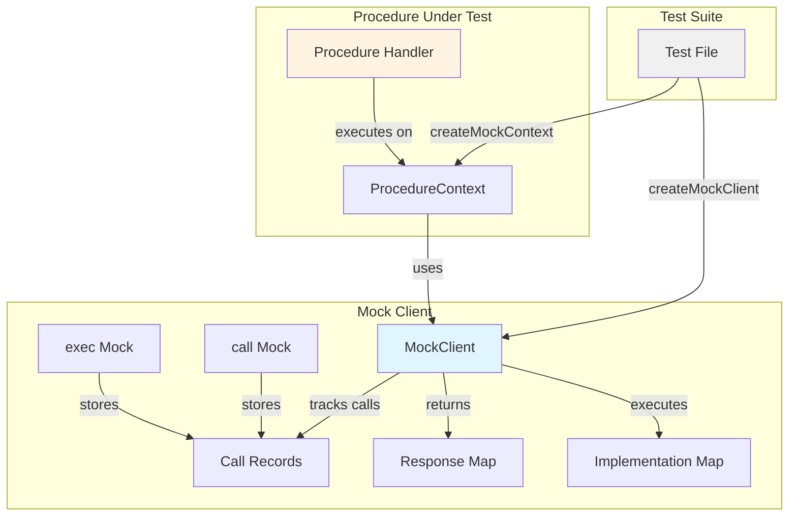
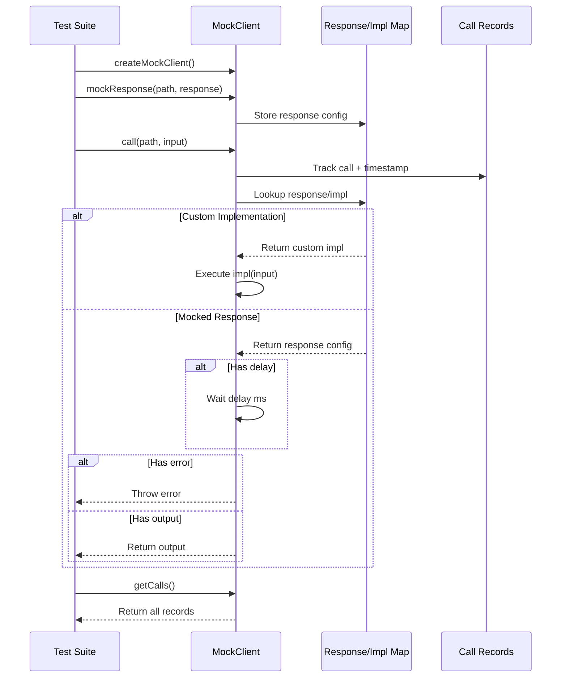
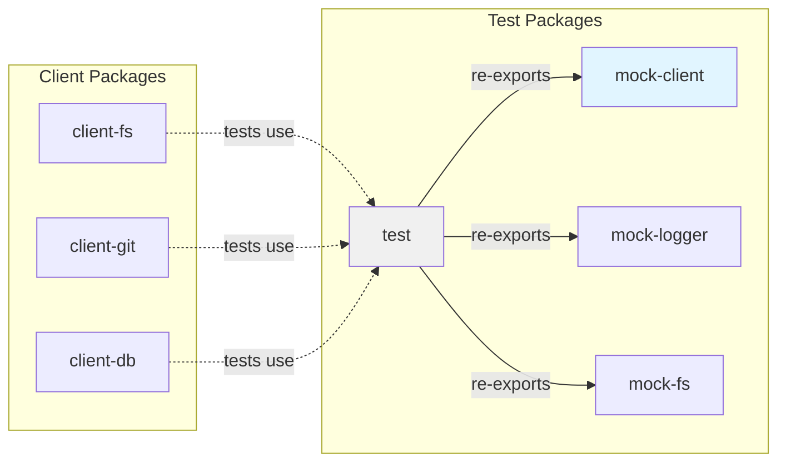

# @mark1russell7/mock-client

[](https://www.npmjs.com/package/@mark1russell7/mock-client)
[](https://www.typescriptlang.org/)
[](https://vitest.dev/)

Mock Client implementation for unit testing procedures in the Mark ecosystem. Provides a fully-featured, Vitest-compatible mock that tracks procedure calls, supports custom implementations, and enables comprehensive testing of procedure-based code.

## Overview

`@mark1russell7/mock-client` is a testing utility that simulates the behavior of the real Mark Client (`@mark1russell7/client`). It enables developers to:

- **Test procedures in isolation** without requiring a real client connection
- **Track all procedure calls** with timestamps and input data
- **Mock responses** with custom outputs, errors, or delays
- **Verify call patterns** using Vitest-compatible mock functions
- **Create test contexts** for procedure handlers

## Installation

```bash
npm install github:mark1russell7/mock-client#main
```

## Architecture



### Data Flow



## Quick Start

```typescript
import { describe, it, expect, beforeEach } from "vitest";
import { createMockClient, createMockContext, mockOutput } from "@mark1russell7/mock-client";

describe("myProcedure", () => {
  let mockClient: MockClient;

  beforeEach(() => {
    mockClient = createMockClient();
  });

  it("should read and process file", async () => {
    // Configure mock response
    mockClient.mockResponse(["fs", "read"], {
      output: { content: "Hello, World!" },
    });

    // Create context with mock client
    const ctx = createMockContext({ client: mockClient });

    // Call procedure under test
    const result = await myProcedure({ path: "./file.txt" }, ctx);

    // Verify calls were made
    const calls = mockClient.getCallsFor(["fs", "read"]);
    expect(calls).toHaveLength(1);
    expect(calls[0].input).toEqual({ path: "./file.txt" });
  });
});
```

## API Reference

### Types

#### `ProcedurePath`
```typescript
type ProcedurePath = readonly string[];
```
Represents a procedure path as an array of strings (e.g., `["fs", "read"]`).

#### `MockFn<TArgs, TReturn>`
```typescript
interface MockFn<TArgs extends unknown[] = unknown[], TReturn = unknown> {
  (...args: TArgs): TReturn;
  mockClear(): void;
  mock: {
    calls: TArgs[];
  };
}
```
Vitest-compatible mock function interface with call tracking.

#### `MockCallRecord`
```typescript
interface MockCallRecord {
  path: ProcedurePath;        // Procedure path that was called
  input: unknown;             // Input data passed to the call
  timestamp: number;          // Unix timestamp in milliseconds
}
```
Record of a single procedure call.

#### `MockResponse<T>`
```typescript
interface MockResponse<T = unknown> {
  output?: T | undefined;     // Response data to return
  error?: Error | undefined;  // Error to throw
  delay?: number | undefined; // Delay in milliseconds before responding
}
```
Configuration for mocked procedure responses.

#### `MockClient`
```typescript
interface MockClient {
  // Mock functions (Vitest-compatible)
  call: MockFn<[ProcedurePath, unknown], Promise<unknown>>;
  exec: MockFn<[unknown, unknown?], Promise<unknown>>;

  // Call tracking
  getCalls(): MockCallRecord[];
  getCallsFor(path: ProcedurePath): MockCallRecord[];
  clearCalls(): void;

  // Response mocking
  mockResponse<T>(path: ProcedurePath, response: MockResponse<T>): void;
  mockImplementation<TInput, TOutput>(
    path: ProcedurePath,
    impl: (input: TInput) => TOutput | Promise<TOutput>
  ): void;

  // Reset
  reset(): void;
}
```

#### `MockProcedureContext`
```typescript
interface MockProcedureContext {
  metadata: Record<string, unknown>;
  path: ProcedurePath;
  client: MockClient;
  signal?: AbortSignal | undefined;
}
```
Mock context for testing procedure handlers.

#### `CreateMockClientOptions`
```typescript
interface CreateMockClientOptions {
  defaultResponse?: MockResponse | undefined;  // Default response for unmocked calls
  recordCalls?: boolean | undefined;           // Enable/disable call recording (default: true)
}
```

### Factory Functions

#### `createMockClient(options?)`
Creates a new mock client instance.

```typescript
function createMockClient(options?: CreateMockClientOptions): MockClient
```

**Parameters:**
- `options.defaultResponse` - Default response for procedures without explicit mocks
- `options.recordCalls` - Whether to record calls (default: `true`)

**Returns:** `MockClient` instance

**Example:**
```typescript
import { createMockClient } from "@mark1russell7/mock-client";

const client = createMockClient({
  defaultResponse: { output: "default" },
  recordCalls: true,
});
```

#### `createMockContext(options?)`
Creates a mock procedure context for testing handlers.

```typescript
function createMockContext(options?: {
  path?: ProcedurePath | undefined;
  metadata?: Record<string, unknown> | undefined;
  client?: MockClient | undefined;
}): MockProcedureContext
```

**Parameters:**
- `options.path` - Procedure path (default: `["test", "procedure"]`)
- `options.metadata` - Context metadata (default: `{}`)
- `options.client` - Mock client instance (default: new `createMockClient()`)

**Returns:** `MockProcedureContext` instance

**Example:**
```typescript
import { createMockContext } from "@mark1russell7/mock-client";

const context = createMockContext({
  path: ["fs", "read"],
  metadata: { userId: "123" },
});
```

### Helper Functions

#### `mockOutput<T>(output)`
Creates a response that returns the given output.

```typescript
function mockOutput<T>(output: T): MockResponse<T>
```

**Example:**
```typescript
import { mockOutput } from "@mark1russell7/mock-client";

client.mockResponse(["fs", "read"], mockOutput("file contents"));
```

#### `mockError(error)`
Creates a response that throws an error.

```typescript
function mockError(error: Error | string): MockResponse
```

**Example:**
```typescript
import { mockError } from "@mark1russell7/mock-client";

client.mockResponse(["fs", "read"], mockError("File not found"));
```

#### `mockDelayed<T>(output, delayMs)`
Creates a response with a delay before returning.

```typescript
function mockDelayed<T>(output: T, delayMs: number): MockResponse<T>
```

**Example:**
```typescript
import { mockDelayed } from "@mark1russell7/mock-client";

client.mockResponse(["api", "fetch"], mockDelayed({ data: "response" }, 1000));
```

### Response Configuration

#### mockResponse

Set a static response for a procedure:

```typescript
mockClient.mockResponse(["fs", "read"], {
  output: { content: "file contents" },
});

// With delay
mockClient.mockResponse(["db", "query"], {
  output: { rows: [] },
  delay: 100,
});

// With error
mockClient.mockResponse(["fs", "write"], {
  error: new Error("Permission denied"),
});
```

#### mockImplementation

Set a dynamic implementation:

```typescript
mockClient.mockImplementation(["math", "add"], (input: { a: number; b: number }) => {
  return { result: input.a + input.b };
});

// Async implementation
mockClient.mockImplementation(["db", "find"], async (input) => {
  const results = await someAsyncOperation(input);
  return { items: results };
});
```

### Helper Functions

```typescript
import { mockOutput, mockError, mockDelayed } from "@mark1russell7/mock-client";

// Quick response helpers
mockClient.mockResponse(["proc"], mockOutput({ data: "value" }));
mockClient.mockResponse(["proc"], mockError("Something went wrong"));
mockClient.mockResponse(["proc"], mockDelayed({ data: "value" }, 500));
```

### createMockContext(options?)

Create a mock procedure context for testing handlers.

```typescript
interface MockProcedureContext {
  metadata: Record<string, unknown>;
  path: string[];
  client: MockClient;
  signal?: AbortSignal;
}

const ctx = createMockContext({
  path: ["my", "procedure"],
  metadata: { userId: "123" },
  client: mockClient,
});
```

## Usage Examples

### Basic Mocking

```typescript
import { describe, it, expect } from "vitest";
import { createMockClient, mockOutput, mockError } from "@mark1russell7/mock-client";

describe("MockClient", () => {
  it("should mock procedure responses", async () => {
    const client = createMockClient();

    // Mock successful response
    client.mockResponse(["fs", "read"], mockOutput("file contents"));

    const result = await client.call(["fs", "read"], { path: "/test.txt" });
    expect(result).toBe("file contents");
  });

  it("should mock errors", async () => {
    const client = createMockClient();

    client.mockResponse(["fs", "read"], mockError("ENOENT: File not found"));

    await expect(
      client.call(["fs", "read"], { path: "/missing.txt" })
    ).rejects.toThrow("ENOENT");
  });
});
```

### Call Tracking

```typescript
import { describe, it, expect } from "vitest";
import { createMockClient, mockOutput } from "@mark1russell7/mock-client";

describe("Call Tracking", () => {
  it("should track all procedure calls", async () => {
    const client = createMockClient();
    client.mockResponse(["db", "query"], mockOutput([{ id: 1 }]));

    await client.call(["db", "query"], { sql: "SELECT * FROM users" });
    await client.call(["db", "query"], { sql: "SELECT * FROM posts" });

    const calls = client.getCalls();
    expect(calls).toHaveLength(2);
    expect(calls[0].path).toEqual(["db", "query"]);
    expect(calls[0].input).toEqual({ sql: "SELECT * FROM users" });
    expect(calls[0].timestamp).toBeTypeOf("number");
  });

  it("should filter calls by path", async () => {
    const client = createMockClient();
    client.mockResponse(["fs", "read"], mockOutput("content"));
    client.mockResponse(["db", "query"], mockOutput([]));

    await client.call(["fs", "read"], { path: "/file.txt" });
    await client.call(["db", "query"], { sql: "SELECT 1" });

    const fsCalls = client.getCallsFor(["fs", "read"]);
    expect(fsCalls).toHaveLength(1);
    expect(fsCalls[0].input).toEqual({ path: "/file.txt" });
  });
});
```

### Custom Implementations

```typescript
import { describe, it, expect } from "vitest";
import { createMockClient } from "@mark1russell7/mock-client";

describe("Custom Implementation", () => {
  it("should use custom implementation", async () => {
    const client = createMockClient();

    // Dynamic response based on input
    client.mockImplementation(["math", "double"], (input: number) => {
      return input * 2;
    });

    const result = await client.call(["math", "double"], 5);
    expect(result).toBe(10);
  });

  it("should support async implementations", async () => {
    const client = createMockClient();

    client.mockImplementation(["api", "fetch"], async (url: string) => {
      // Simulate async operation
      await new Promise(resolve => setTimeout(resolve, 10));
      return { url, status: 200 };
    });

    const result = await client.call(["api", "fetch"], "https://api.example.com");
    expect(result).toEqual({ url: "https://api.example.com", status: 200 });
  });
});
```

### Testing Procedure Handlers

```typescript
import { describe, it, expect } from "vitest";
import { createMockContext, mockOutput } from "@mark1russell7/mock-client";

// Example procedure handler
async function copyFile(
  input: { source: string; dest: string },
  context: { client: { call: (path: string[], input: unknown) => Promise<unknown> } }
) {
  const content = await context.client.call(["fs", "read"], { path: input.source });
  await context.client.call(["fs", "write"], { path: input.dest, content });
  return { success: true };
}

describe("Procedure Handler", () => {
  it("should test procedure with mock context", async () => {
    const context = createMockContext({
      path: ["fs", "copy"],
    });

    // Setup mocks
    context.client.mockResponse(["fs", "read"], mockOutput("file contents"));
    context.client.mockResponse(["fs", "write"], mockOutput({ written: true }));

    // Execute procedure
    const result = await copyFile(
      { source: "/src.txt", dest: "/dest.txt" },
      context
    );

    expect(result).toEqual({ success: true });

    // Verify interactions
    const calls = context.client.getCalls();
    expect(calls).toHaveLength(2);
    expect(calls[0].path).toEqual(["fs", "read"]);
    expect(calls[1].path).toEqual(["fs", "write"]);
  });
});
```

### Response Delays

```typescript
import { describe, it, expect } from "vitest";
import { createMockClient, mockDelayed } from "@mark1russell7/mock-client";

describe("Response Delays", () => {
  it("should delay responses", async () => {
    const client = createMockClient();

    client.mockResponse(["slow", "operation"], mockDelayed("result", 100));

    const start = Date.now();
    const result = await client.call(["slow", "operation"], {});
    const duration = Date.now() - start;

    expect(result).toBe("result");
    expect(duration).toBeGreaterThanOrEqual(100);
  });
});
```

### Cleanup and Reset

```typescript
import { describe, it, expect, beforeEach } from "vitest";
import { createMockClient, mockOutput } from "@mark1russell7/mock-client";

describe("Cleanup", () => {
  let client: ReturnType<typeof createMockClient>;

  beforeEach(() => {
    client = createMockClient();
  });

  it("should clear call history", async () => {
    client.mockResponse(["test"], mockOutput("result"));

    await client.call(["test"], {});
    expect(client.getCalls()).toHaveLength(1);

    client.clearCalls();
    expect(client.getCalls()).toHaveLength(0);
  });

  it("should reset all state", async () => {
    client.mockResponse(["test"], mockOutput("result"));
    await client.call(["test"], {});

    client.reset();

    // Calls cleared
    expect(client.getCalls()).toHaveLength(0);

    // Mock functions cleared
    expect(client.call.mock.calls).toHaveLength(0);

    // Responses cleared (will use default)
    const result = await client.call(["test"], {});
    expect(result).toBeUndefined();
  });
});
```

## Configuration

### Default Response

Set a default response for all unmocked procedures:

```typescript
const client = createMockClient({
  defaultResponse: {
    output: { success: true },
  },
});

// Any unmocked procedure returns { success: true }
const result = await client.call(["any", "procedure"], {});
console.log(result); // { success: true }
```

### Disable Call Recording

Disable call tracking for performance-critical tests:

```typescript
const client = createMockClient({
  recordCalls: false,
});

await client.call(["test"], {});
console.log(client.getCalls()); // []
```

## Integration with Ecosystem

### Dependencies

This package is standalone with only Vitest as a peer dependency:

```json
{
  "peerDependencies": {
    "vitest": "^3.0.0"
  }
}
```

### Used By

- `@mark1russell7/test` - Re-exports mock-client for consolidated testing utilities
- `@mark1russell7/client-*` packages - Use for unit testing procedures

### Testing Architecture



## Best Practices

### 1. Use Type-Safe Mocks

```typescript
interface ReadFileInput {
  path: string;
}

interface ReadFileOutput {
  content: string;
}

client.mockImplementation<ReadFileInput, ReadFileOutput>(
  ["fs", "read"],
  (input) => {
    return { content: `Contents of ${input.path}` };
  }
);
```

### 2. Setup/Teardown

```typescript
import { beforeEach, afterEach } from "vitest";

let client: MockClient;

beforeEach(() => {
  client = createMockClient();
});

afterEach(() => {
  client.reset();
});
```

### 3. Verify Specific Calls

```typescript
const fsCalls = client.getCallsFor(["fs", "write"]);
expect(fsCalls).toHaveLength(1);
expect(fsCalls[0].input).toMatchObject({
  path: "/expected/path.txt",
});
```

### 4. Combine with Vitest Assertions

```typescript
// Verify mock was called
expect(client.call).toHaveBeenCalledTimes(2);
expect(client.call).toHaveBeenCalledWith(["fs", "read"], { path: "/test.txt" });

// Or use built-in tracking
const calls = client.getCalls();
expect(calls[0].path).toEqual(["fs", "read"]);
```

## Troubleshooting

### Mock not returning expected value

Ensure the path exactly matches:

```typescript
// Wrong - different path
client.mockResponse(["fs", "read"], mockOutput("content"));
await client.call(["fs", "readFile"], {}); // Returns undefined

// Correct - exact match
client.mockResponse(["fs", "read"], mockOutput("content"));
await client.call(["fs", "read"], {}); // Returns "content"
```

### Calls not being tracked

Check that `recordCalls` is enabled:

```typescript
const client = createMockClient({ recordCalls: true });
```

### Type errors with mockImplementation

Ensure input/output types match:

```typescript
// Type mismatch
client.mockImplementation<string, number>(["test"], (input) => {
  return input; // Error: string not assignable to number
});

// Correct types
client.mockImplementation<string, number>(["test"], (input) => {
  return input.length;
});
```

## License

MIT

## Contributing

See the main repository for contribution guidelines.

## Related Packages

- `@mark1russell7/test` - Unified test utilities (includes this package)
- `@mark1russell7/mock-logger` - Mock logger for testing
- `@mark1russell7/mock-fs` - Mock file system for testing
- `@mark1russell7/client` - Real client implementation
